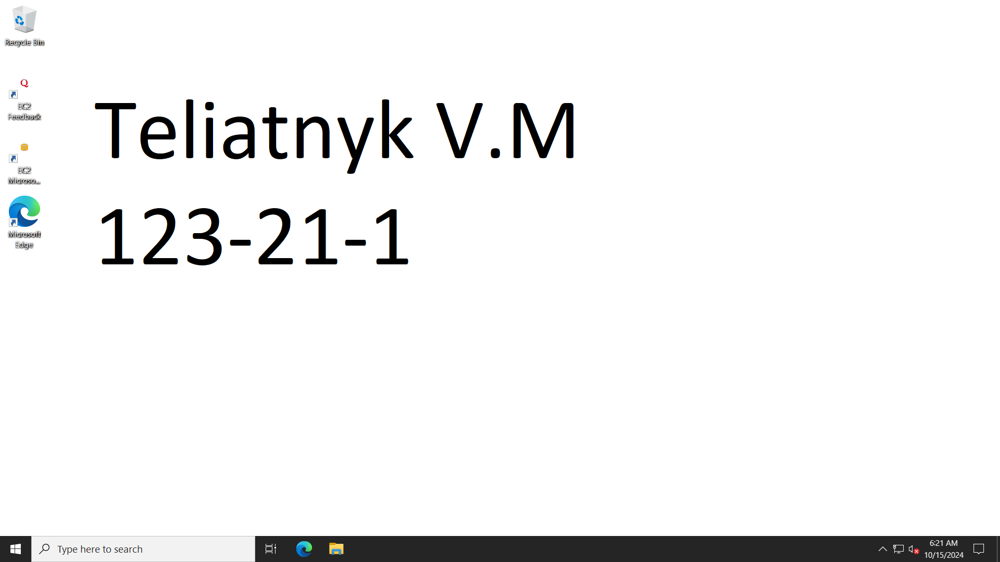

IP: 16.171.154.55
password: $ON4bbRnGy1E11);wiKeA$jZ5yc-Dyfo

### Встановлення сервера на AWS

- Заходимо в EC2 і створюємо Instance
- Отримуємо пароль для доступу до серверу
- Скачуємо Remote Desktop Connection та вказуємо всі необхідні дані
- Заходимо в віндовс та змінюємо бекграунд

